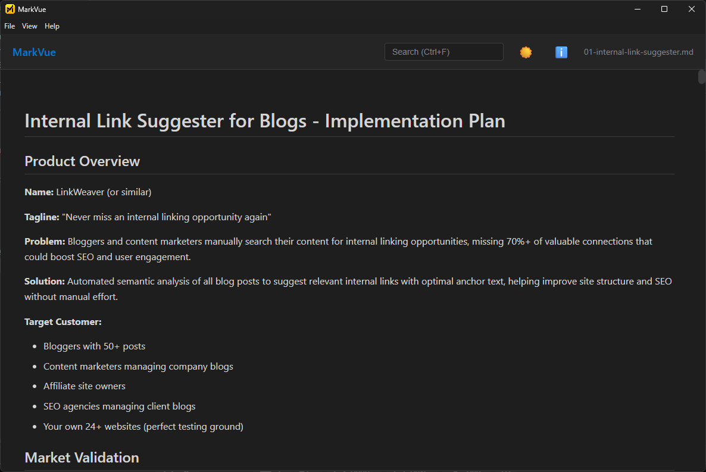
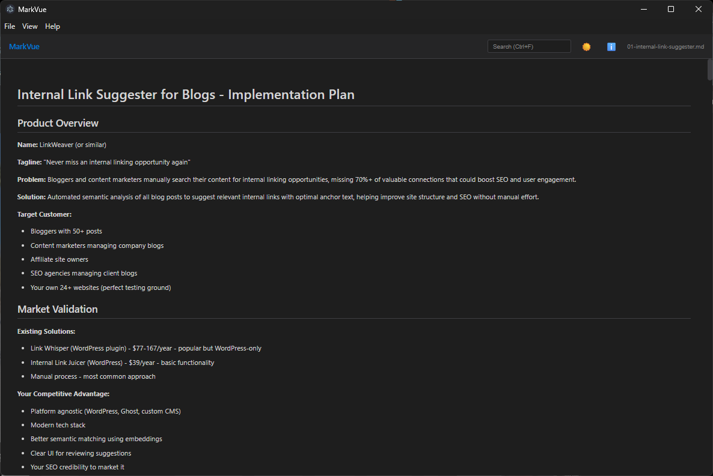

# MarkVue

> Beautiful markdown viewer for Windows, built for the AI era.



## Why MarkVue?

AI tools love markdown. Your computer doesn't. MarkVue fixes that.

- **Fast**: Opens instantly, no IDE bloat
- **Clean**: Distraction-free reading experience
- **Smart**: Syntax highlighting, dark mode, clean typography
- **Native**: Proper Windows app, not a browser extension

## Features



✨ Clean, readable rendering  
🎨 Dark & light themes  
💻 Code syntax highlighting  
⚡ Lightning fast performance  
🔗 File association - double-click any .md file  
🆓 Completely free and open source

## Installation

### Windows Installer
Download the latest release from [Releases](https://github.com/jeromeheuze/markvue/releases)

### Portable Version
Also available for USB stick usage.

## Usage

1. Install MarkVue
2. Double-click any `.md` file
3. Enjoy beautifully rendered markdown

Or use File → Open (Ctrl+O) to browse files.

## Built With

- Electron
- Alpine.js
- Marked.js
- Highlight.js

## Why I Built This

After using AI tools like Claude and ChatGPT, I found myself drowning in markdown files with no good way to view them on Windows. VS Code felt like overkill, and browser extensions were clunky. So I built MarkVue.

## Development

```bash
# Install dependencies
npm install

# Run in development mode
npm start

# Build for Windows
npm run build:win
```

## Contributing

Issues and PRs welcome! This is a learning project and portfolio piece.

## License

MIT © Jerome

## Connect

- 🔗 [LinkedIn](https://www.linkedin.com/in/jeromeheuze)
- 🔗 [Website](https://jeromeheuze.com)
- 🎮 [Other Projects](https://github.com/jeromeheuze)

---

**If you find this useful, give it a ⭐ on GitHub!**
